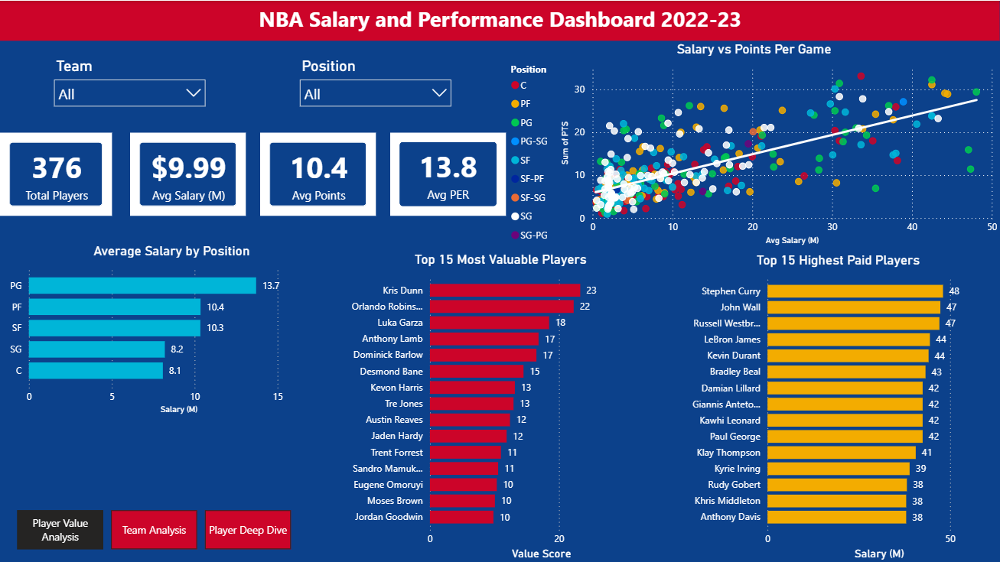
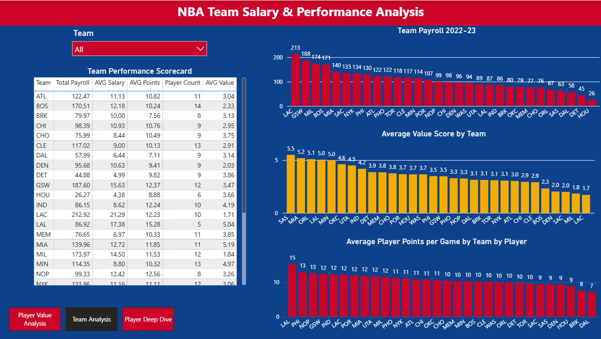
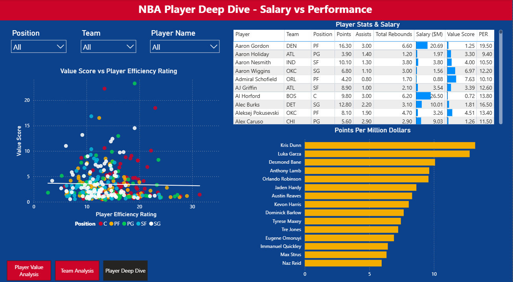
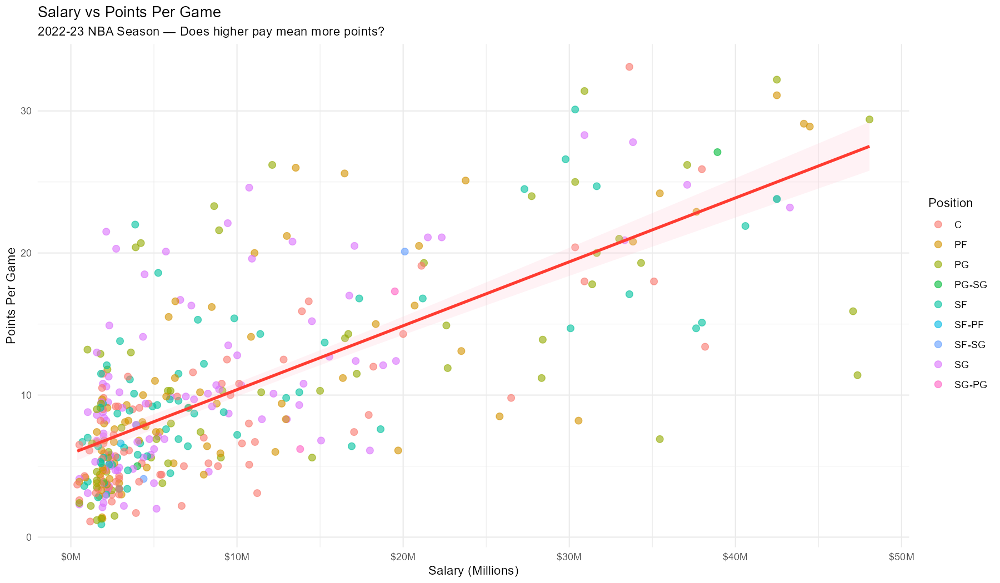
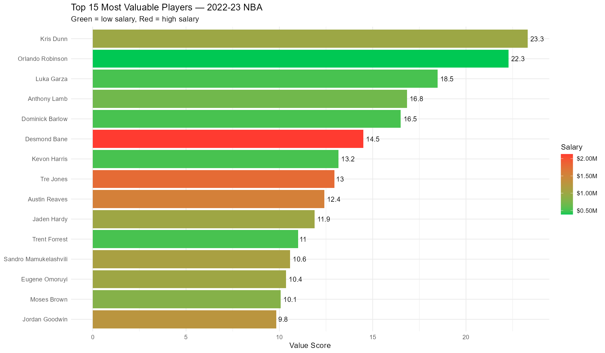
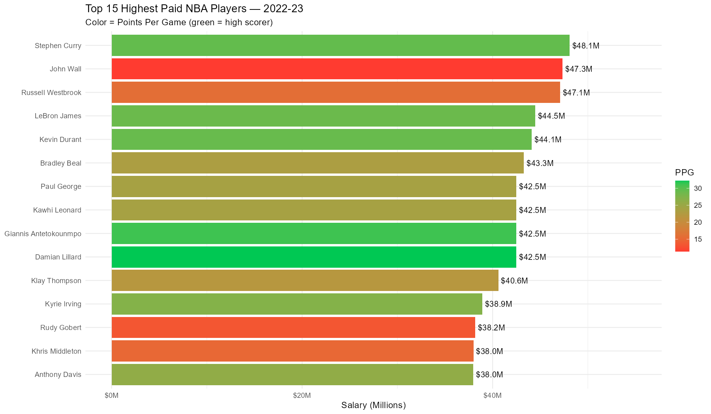
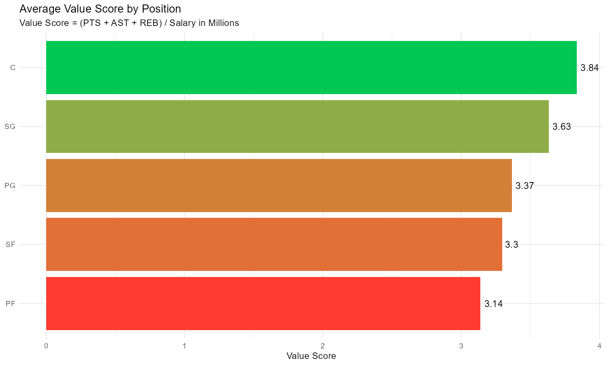

# NBA Salary & Performance Analysis
**Tools:** Python | R | SQL | Power BI | Excel  
**Data:** NBA 2022-23 Season Stats & Salaries

## Overview
End-to-end analysis of NBA player value using all 6 analytical tools.
Identifies overpaid players, hidden gems, and team salary efficiency
across the 2022-23 season.

## Power BI Dashboard

## R Analysis Charts

## Key Findings
- John Wall earned $47M while barely playing — worst value contract
- Kris Dunn was the most valuable player by value score
- LA Clippers had the highest payroll at $213M
- Point Guards earn the most on average across all positions

## Project Files
| File | Tool | Description |
|---|---|---|
| NBAData.ipynb | Python | Data cleaning & value metrics |
| NBADashboard.pbix | Power BI | 3-page interactive dashboard |
| NBASalaryAnalysis.xlsx | Excel | 6-sheet workbook with PivotTables |
| *.sql | SQL | 5 analytical queries |
| plot_*.png | R | ggplot2 visualizations |
